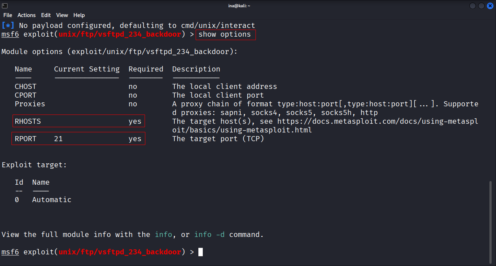
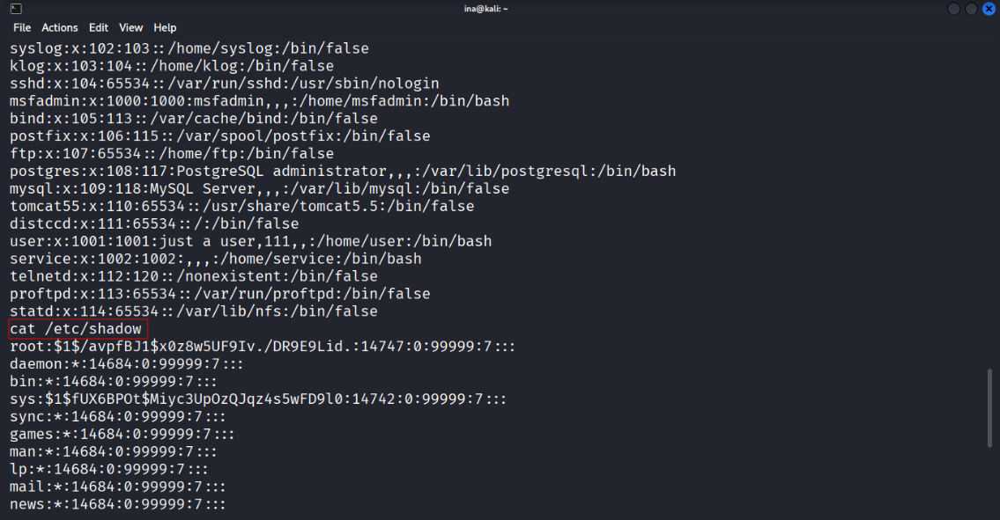

# Metasploitable2 Exploitation - VSftpd Backdoor & Hash Cracking

**Objective:** To exploit the VSftpd 2.3.4 backdoor vulnerability on Metasploitable2 using Metasploit, obtain a root shell, and then extract and crack user password hashes (msfadmin, user) using Netcat and John the Ripper.

**Skills Demonstrated:**

* Vulnerability Exploitation (CVE-2011-2523)
* Metasploit Framework Usage
* Linux File System Navigation
* Password Hash Extraction (`/etc/passwd`, `/etc/shadow`)
* Data Transfer Techniques (Netcat)
* Password Cracking (John the Ripper)
* Post-Exploitation Enumeration

**Tools Used:**

* **Metasploitable2:** The vulnerable target machine.
* **Kali Linux:** The attacking operating system.
* **Nmap:** For network scanning and service identification.
* **Metasploit Framework:** For exploiting the VSftpd backdoor.
* **Netcat:** For transferring files between machines.
* **John the Ripper:** For cracking password hashes.
* **Flameshot:** For capturing high-quality screenshots throughout the project.
* **CherryTree:** For organizing notes, steps, and observations during the assessment.

---

## Project Walk-through:

### Target Identification and Initial Scan:
I logged into my Metasploitable2 virtual machine to find its IP address. Subsequently, I performed an Nmap scan targeting this IP address. The purpose of this scan was to enumerate open ports and identify running services, which could potentially expose vulnerabilities. The Nmap scan quickly highlighted `vsftpd 2.3.4` running on port 21, indicating a known vulnerability. This service version is notoriously vulnerable to a backdoor.

### Metasploit Module Selection:
I launched the Metasploit Framework console (msfconsole) and searched for available exploits related to `vsftpd 2.3.4`. The `exploit/unix/ftp/vsftpd_234_backdoor` module was the primary candidate.

### Module Configuration and Exploitation:
I selected the identified exploit module and checked its required options using `show options`. The `RHOSTS` (remote host) option was the only mandatory parameter. I set `RHOSTS` to the IP address of Metasploitable2 and then executed the exploit using the `exploit` command. The exploit leveraged the backdoor in VSftpd 2.3.4, which allows arbitrary command execution. Upon successful exploitation, Metasploit provided a root shell on the target machine.

---

## Post-Exploitation: Password Hash Extraction and Cracking

### Locating passwd and shadow Files:
From the root shell, I navigated to the `/etc/` directory, which contains crucial system configuration files. I inspected the contents of the `passwd` file, which lists user accounts but typically contains 'x' in place of the password hash. I identified `msfadmin` and `user` as standard user accounts on Metasploitable2, whose passwords I intended to crack for further access.

### Extracting Password Hashes from shadow:
I then viewed the contents of the `shadow` file (`/etc/shadow`). This file contains the hashed passwords for user accounts and is readable only by root for security reasons.

### Transferring Files with Netcat:
To transfer the `passwd` and `shadow` files securely from the Metasploitable2 machine to my Kali Linux machine, I used Netcat.This allowed for direct, quick transfer of the sensitive files without relying on other services.

### Preparing Hashes for John the Ripper:
Before cracking, I used the `unshadow` command (part of the John the Ripper suite) to combine the `passwd.txt` and `shadow.txt` files into a single format that John can readily process.

`unshadow passwd.txt shadow.txt > hashes.txt`

### Cracking Hashes with John the Ripper:
I then attempted to crack the hashes using John the Ripper with a standard wordlist. When this initial attempt did not yield results for `msfadmin` and `user`, I switched to `john --single unshadowed.txt`. This second attempt successfully cracked the passwords for both `msfadmin` and `user`.

